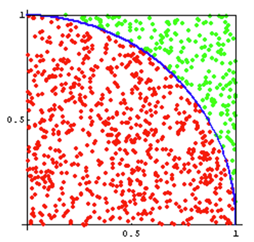

# HOMEWORK 1: Exercises for Monte Carlo Methods

| Student ID | Student Name |
| :--------: | :----------: |
|  18342075  |    米家龙    |

> Lectured by 梁上松, Sun Yat-sen University

- [HOMEWORK 1: Exercises for Monte Carlo Methods](#homework-1-exercises-for-monte-carlo-methods)
  - [题目](#题目)
    - [Exercise 1](#exercise-1)
    - [Exercise 2](#exercise-2)
    - [Exercise 3](#exercise-3)
  - [代码](#代码)
    - [Exercise 1 code](#exercise-1-code)
    - [Exercise 2 code](#exercise-2-code)
    - [Exercise 3 code](#exercise-3-code)

## 题目

### Exercise 1

蒙特卡洛方法可以用于产生接近 $\pi$ 的近似值。图1显示了一个带有 1/4 内切圆在内的边长为 1 的正方形。正方形的面积是1，该 1/4 圆的面积为 $\pi / 4$ 。通过编程实现在这个正方形中产生均匀分布的点。落在圈内（红点）的点和总的投在正方形（红和绿点）上的点的比率给出了 $\pi / 4$ 的近似值。这一过程称为使用蒙特卡洛方法来仿真逼近 $\pi$ 实际值。令 $N$ 表示总的投在正方形的点。当投点个数分别是20, 50, 100, 200, 300, 500, 1000, 5000时，$\pi$ 值分别是多少？对于每个N，每次实验算出 $\pi$ 值，重复这个过程20次，并在表中记下均值和方差。



结果

| 点数量 | 均值（保留4位小数） | 方差（保留8位小数） |
| :----: | :-----------------: | :-----------------: |
|   20   |       3.2500        |     0.12750000      |
|   50   |       3.1400        |     0.03832000      |
|  100   |       3.1880        |     0.01985600      |
|  200   |       3.1080        |     0.00841600      |
|  300   |       3.1547        |     0.00823822      |
|  500   |       3.1360        |     0.00731520      |
|  1000  |       3.1272        |     0.00251936      |
|  5000  |       3.1481        |     0.00046527      |

### Exercise 2

我们现在尝试通过蒙特卡洛的方法求解如下的积分：

$$
\int_{0}^{1} x^3
$$

该积分的求解我们可以直接求解，即有 $\int_{x = 0}^1 x^3 = 1/4$ 。如果你用蒙特卡洛的方法求解该积分，你认为 $x$ 可以通过什么分布采样获得？如果采样次数是分别是 $N = 5, 10, 20, 30, 40, 50, 60, 70, 80, 100$，积分结果有多好？对于每个采样次数 $N$ ，重复蒙特卡洛过程100次，求出均值和方差，然后在表格中记录对应的均值和方差。

1. $x$ 可以通过均匀分布采样获得
2. 随着采样次数增加，积分结果会越来越接近真实值

结果

| 点数量 | 均值（保留4位小数） | 方差（保留8位小数） |
| :----: | :-----------------: | :-----------------: |
|   5    |       0.2680        |     0.04097600      |
|   10   |       0.2550        |     0.01687500      |
|   20   |       0.2545        |     0.01130475      |
|   30   |       0.2480        |     0.00674044      |
|   40   |       0.2477        |     0.00492619      |
|   50   |       0.2588        |     0.00406256      |
|   60   |       0.2567        |     0.00345556      |
|   70   |       0.2504        |     0.00255696      |
|   80   |       0.2435        |     0.00200150      |
|  100   |       0.2484        |     0.00182744      |

### Exercise 3

我们现在尝试通过蒙特卡洛的方法求解如下的更复杂的积分：
$$
\int_{x = 2}^{4} \int_{y = -1}^{1} f(x, y) = \frac{y^2 *e ^ {- y ^ 2} + x ^ 4* e^{- x^2}}{x * e^{-x^2}}
$$

你能够通过公式直接求解上述的积分吗？如果你用蒙特卡洛的方法求解该积分，你认为 $(x, y)$ 可以通过什么分布采样获得？如果点 $(x, y)$ 的采样次数是分别是 $N = 10, 20, 30, 40, 50, 60, 70, 80, 100, 200, 500$ , 积分结果有多好？对于每个采样次数 $N$ ，重复蒙特卡洛过程100次，求出均值和方差，然后在表格中记录对应的均值和方差。

1. 难以获得原函数
2. 通过均匀分布的蒙特卡洛采样获得
3. 随着 $N$ 增加而趋近与真实值

结果

| 点数量 | 均值（保留4位小数） | 方差（保留8位小数）  |
| :----: | :-----------------: | :------------------: |
|   5    |     99125.0544      | 20783080466.22911072 |
|   10   |     121791.2765     | 16276094736.96162605 |
|   20   |     119719.4934     | 7245124932.63554668  |
|   30   |     108509.2421     | 3250208524.88488388  |
|   40   |     112004.0592     | 3432696350.98693466  |
|   50   |     111179.4271     | 3317886525.23683882  |
|   60   |     111731.9268     | 2076129737.40643930  |
|   70   |     110854.6858     | 1614742270.39968562  |
|   80   |     115486.6711     | 1437503551.95903778  |
|  100   |     113920.3845     |  946498713.97449982  |
|  200   |     113537.7377     |  580140337.02563691  |

## 代码

### Exercise 1 code

```js
const loopTime = 20;
const dotNums = 20; // 投点个数分别是20, 50, 100, 200, 300, 500, 1000, 5000时，pi值分别是多少
const dotNumsList = [20, 50, 100, 200, 300, 500, 1000, 5000];

/**
 * 随机获取一个点，并判断是否在 1/4 个圆上
 * @returns 返回这个点是否在圆上；如果在，返回 true，否则返回 false
 */
function getOneDot() {
  let x = Math.random();
  let y = Math.random();
  return Math.pow(x, 2) + Math.pow(y, 2) <= 1;
}

/**
 * 获取一张图
 * @param dotNums 点的个数
 * @returns 蒙特卡洛方法计算出的 pi 值
 */
function getAMap(dotNums) {
  let circle = 0;
  for (let i = 0; i < dotNums; i++) {
    if (getOneDot()) {
      circle++;
    }
  }

  return 4 * (circle / dotNums);
}

function main() {
  let resList = [];
  for (let num of dotNumsList) {
    resList.push([]);
    let mean = 0; // 均值
    let variance = 0; // 方差

    for (let i = 0; i < loopTime; i++) {
      let pi = getAMap(num); // 当前结果
      resList[resList.length - 1].push(pi);
      mean += pi;
    }
    mean /= loopTime; // 计算均值

    // 计算方差
    for (let res of resList[resList.length - 1]) {
      variance += Math.pow(mean - res, 2);
    }
    variance /= loopTime;

    console.log(
      `点数：${num} \t 均值：${mean.toFixed(4)} \t 方差：${variance.toFixed(8)}`
    );
  }
}

main();
```

### Exercise 2 code

```js
const loopTime = 100;
const dotNumList = [5, 10, 20, 30, 40, 50, 60, 70, 80, 100];

/**
 * 随机获取一个点，判断是否在函数积分中
 * @param {Function} func 需要计算定积分的函数
 * @returns {Boolean} 如果这个点在积分中，返回 true；否则返回 false
 */
function getOneDot(func) {
  let x = Math.random();
  let y = Math.random();

  return y <= func(x);
}

/**
 * 根据点的数量计算积分
 * @param {Number} dotNum
 * @param {Function} func
 * @returns {Number} 返回蒙特卡洛方法采样得到的积分的近似值
 */
function getAMap(dotNum, func) {
  let res = 0;
  for (let i = 0; i < dotNum; i++) {
    if (getOneDot(func)) {
      res++;
    }
  }

  return res / dotNum;
}

/**
 * 需要计算的定积分函数
 * @param {Number} x 横坐标
 * @returns {Number} 纵坐标
 */
function originFunction(x) {
  return Math.pow(x, 3);
}

function main() {
  let resList = [];
  for (let num of dotNumList) {
    resList.push([]);
    let mean = 0; // 均值
    let variance = 0; // 方差

    for (let i = 0; i < loopTime; i++) {
      let intergration = getAMap(num, originFunction); // 当前结果
      resList[resList.length - 1].push(intergration);
      mean += intergration;
    }
    mean /= loopTime; // 计算均值

    // 计算方差
    for (let res of resList[resList.length - 1]) {
      variance += Math.pow(mean - res, 2);
    }
    variance /= loopTime;

    console.log(
      `点数：${num} \t 均值：${mean.toFixed(4)} \t 方差：${variance.toFixed(8)}`
    );
  }
}

main();
```

### Exercise 3 code

```js
const loopTime = 100;
const dotNumList = [5, 10, 20, 30, 40, 50, 60, 70, 80, 100, 200];

/**
 * 随机获取一个点，计算期望积分
 * @param {Function} func 需要计算定积分的函数
 * @returns {Number} 返回积分
 */
function getOneDot(func) {
  let x = Math.random() * 2 + 2; // x ~ [-1, 1]
  let y = Math.random() * 2 - 1; // x ~ [2, 4]
  let z = func(x, y) * 2 * 2;

  return z;
}

/**
 * 根据点的数量计算积分
 * @param {Number} dotNum
 * @param {Function} func
 * @returns {Number} 返回蒙特卡洛方法采样得到的积分的近似值
 */
function getAMap(dotNum, func) {
  let res = 0;
  let tmp = [];
  for (let i = 0; i < dotNum; i++) {
    let t = getOneDot(func);
    res += t;
    tmp.push(t);
  }
  return res / dotNum;
}

/**
 * 需要计算的定积分函数
 * @param {Number} x 横坐标
 * @param {Number} y 纵坐标
 * @returns {Number} 结果
 */
function originFunction(x, y) {
  return (
    (Math.pow(y, 2) * Math.pow(Math.E, -Math.pow(y, 2)) +
      Math.pow(x, 4) * Math.pow(Math.E, -Math.pow(x, 2))) /
    (x * Math.pow(Math.E, -Math.pow(x, 2)))
  );
}

function main() {
  let resList = [];
  for (let num of dotNumList) {
    resList.push([]);
    let mean = 0; // 均值
    let variance = 0; // 方差

    for (let i = 0; i < loopTime; i++) {
      let intergration = getAMap(num, originFunction); // 当前结果
      resList[resList.length - 1].push(intergration);
      mean += intergration;
    }
    mean /= loopTime; // 计算均值

    // 计算方差
    for (let res of resList[resList.length - 1]) {
      variance += Math.pow(mean - res, 2);
    }
    variance /= loopTime;

    console.log(
      `点数：${num} \t 均值：${mean.toFixed(4)} \t 方差：${variance.toFixed(8)}`
    );
  }
}

main();
```
