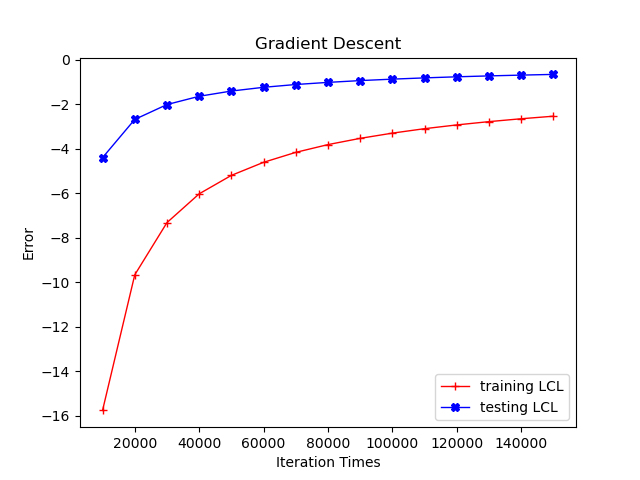
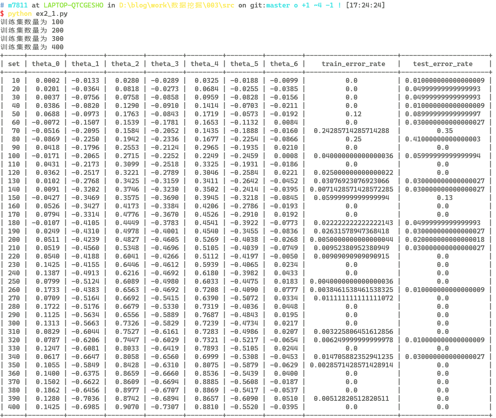

# Homework 3: Linear Regression and Logistic Regression

| Student Name | Student ID |
| :----------: | :--------: |
|    米家龙    |  18342075  |

[TOC]

## Exercise One: Linear Regression

### (a) 梯度下降法训练线性回归模型

> 迭代次数 1500000
> 学习率 0.00015
> 其他参数 0.0

线性回归模型为：

$$
h(x) = \theta_0 + \theta_1 x_1 + \theta_3 x_2
$$

梯度下降迭代，单次迭代为：

$$
\begin{aligned}
  \theta_0 = & \theta_0 - \alpha \frac{1}{m} \sum_{i = 1}^m (h_{\theta} (x^{(i)} - y^{(i)}) \cdot x_0^{(i)}) \\
  \theta_1 = & \theta_1 - \alpha \frac{1}{m} \sum_{i = 1}^m (h_{\theta} (x^{(i)} - y^{(i)}) \cdot x_1^{(i)}) \\
  \theta_2 = & \theta_2 - \alpha \frac{1}{m} \sum_{i = 1}^m (h_{\theta} (x^{(i)} - y^{(i)}) \cdot x_2^{(i)}) \\
\end{aligned}
$$

计算误差：

$$
E_{\theta} = \frac{1}{2m} \sum (h_{\theta} (x^{(i)}) - y^{(i)})^2
$$

结果如图：

### (b) 学习率 0.0002 进行训练

> 迭代次数 2000
> 学习率 0.0002
> 其他参数 0.0

> 由于学习率增大，导致 numpy 中的 float64 无法储存数据，出现越界情况，因此需要降低迭代次数

发现结果会在最后一轮迭代时误差变得极大，结果难以正确收敛，因此需要适当降低学习率，从而加快模型收敛

### (c) 随机梯度下降迭代

> 迭代次数 1500000
> 学习率 0.00015
> 其他参数 0.0

对于每次迭代，用随机选择 $k$ 个数据取代原本的使用全部数据，从而降低训练时间

每次迭代随机选择**1**个点：

每次迭代随机选择**10**个点：

由于随机性的存在，即使随着迭代次数的增加导致测试误差整体下降，但是波动依然很大，但是训练时间较短

## Exercise Two: Logistic Regression

### (a) 建立梯度下降模型

使用 Sigmoid 函数作为逻辑函数

$$
  g(z) = \frac{1}{1 + e^{-z}}
$$

逻辑回归模型为：

$$
\begin{aligned}
  & P(y = 1|x;\theta) = g(\theta^T x) = \frac{1}{1 + e^{-\theta^{T} x}}, \qquad
  \theta = \begin{bmatrix}
    w_0 & w_1 & w_2 & w_3 & w_4 & w_5 & w_6
  \end{bmatrix}
\end{aligned}
$$

因为 $y$ 符合二项分布，对应条件的对数似然函数为：

$$
  LCL = \sum \log p^{(i)} + \sum \log (1 - p^{(i)})
$$

### (b) 模型公式

对上述对数似然函数求偏导

$$
\begin{aligned}
  对 w_0 求偏导 \qquad & \frac{\partial}{\partial w_0} LCL = \sum (y^{(i)} - p^{(i)}) \\
  对 w_j 求偏导 \qquad & \frac{\partial}{\partial w_j} LCL = \sum (y^{(i)} - p^{(i)}) x_j^{(i)}, \qquad j \in [1, 6], \ j 是整数 \\
\end{aligned}
$$

梯度下降为

$$
\begin{aligned}
  w_0 & := w_0 + \alpha \frac{\partial}{\partial w_0} LCL = w_0 + \alpha \sum (y^{(i)} - p^{(i)}) \\
  w_j & := w_j + \alpha \frac{\partial}{\partial w_j} LCL = w_j + \alpha \sum (y^{(i)} - p^{(i)}) x_j^{(i)}, \qquad j \in [1, 6], \ j 是整数
\end{aligned}
$$

### (c) 训练模型

> 学习率 0.00015
> 初始参数 $\theta = \begin{bmatrix} w_0 & w_1 & w_2 & w_3 & w_4 & w_5 & w_6 \end{bmatrix} = \begin{bmatrix} 0 & 0 & 0 & 0 & 0 & 0 & 0 \end{bmatrix}$

在不使用随机抽样的梯度下降的情况下，发现在迭代次数较小的时候便会收敛，并且在测试集上的效果也好

使用随机抽样进行随机梯度下降后，每次迭代选择一个点，效果如下：

每次迭代选择10个点，效果如下：

发现由于随机抽样的存在，会使得上述两个数据变化较大，但是都能在较小迭代次数时使得错误率收敛到0

### (d) 何时错误率为0

当迭代次数足够多时，错误率会降低到0

### (e)

> 学习率为 0.00015
> 迭代次数 150000，每10000次进行一次对比
> 每次随机抽样一个点
> 初始参数 $\theta = \begin{bmatrix} w_0 & w_1 & w_2 & w_3 & w_4 & w_5 & w_6 \end{bmatrix} = \begin{bmatrix} 0 & 0 & 0 & 0 & 0 & 0 & 0 \end{bmatrix}$

效果如图：

发现 LCL 虽然在收敛，但是收敛速率较慢，因此决定调整参数

> 学习率为 0.002
> 迭代次数 150000，每10000次进行一次对比
> 每次随机抽样10个点
> 初始参数 $\theta = \begin{bmatrix} w_0 & w_1 & w_2 & w_3 & w_4 & w_5 & w_6 \end{bmatrix} = \begin{bmatrix} 0 & 0 & 0 & 0 & 0 & 0 & 0 \end{bmatrix}$

可以看到，在至少90000次后，测试 LCL 低于 -1

> 学习率为 0.002
> 迭代次数 150000，每10000次进行一次对比
> 每次使用全部数据
> 初始参数 $\theta = \begin{bmatrix} w_0 & w_1 & w_2 & w_3 & w_4 & w_5 & w_6 \end{bmatrix} = \begin{bmatrix} 0 & 0 & 0 & 0 & 0 & 0 & 0 \end{bmatrix}$

效果如下：

可以发现，使用全部数据收敛的更快，但是训练的时间更久

### (f) k 类

> 学习率 0.00015
> 每个测试集迭代次数150次，迭代完成后进行对比
> 初始参数 $\theta = \begin{bmatrix} w_0 & w_1 & w_2 & w_3 & w_4 & w_5 & w_6 \end{bmatrix} = \begin{bmatrix} 0 & 0 & 0 & 0 & 0 & 0 & 0 \end{bmatrix}$

输出如下：

可以发现，在统一迭代次数和学习率的情况下，随着测试样本的增加，错误率整体逐渐降低；但是由于是随机抽样的样本选取，如果只进行一次完整的过程的话，可能导致错误率的波动