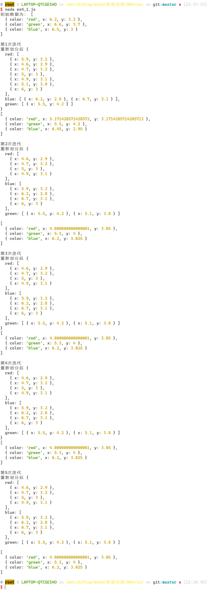

# Homework 3: Clustering Techniques

| Student Name | Student ID |
| :----------: | :--------: |
|    米家龙    |  18342075  |

- [Homework 3: Clustering Techniques](#homework-3-clustering-techniques)
  - [Exercise 1: Implement K-Means Manually](#exercise-1-implement-k-means-manually)
    - [(a). What’s the center of the first cluster (red) after one iteration?](#a-whats-the-center-of-the-first-cluster-red-after-one-iteration)
    - [(b). What’s the center of the second cluster (green) after two iterations?](#b-whats-the-center-of-the-second-cluster-green-after-two-iterations)
    - [(c). What’s the center of the third cluster (blue) when the clustering converges?](#c-whats-the-center-of-the-third-cluster-blue-when-the-clustering-converges)
    - [(d). How many iterations are required for the clusters to converge?](#d-how-many-iterations-are-required-for-the-clusters-to-converge)
  - [Exercise 2: Application of K-Means](#exercise-2-application-of-k-means)
    - [(a). For dataset A, which result is more likely to be generated by K-means method?](#a-for-dataset-a-which-result-is-more-likely-to-be-generated-by-k-means-method)
    - [(b). Dataset B (B1 or B2?)](#b-dataset-b-b1-or-b2)
    - [(c). Dataset C (C1 or C2?)](#c-dataset-c-c1-or-c2)
    - [(d). Dataset D (D1 or D2?)](#d-dataset-d-d1-or-d2)
    - [(e). Dataset E (E1 or E2?)](#e-dataset-e-e1-or-e2)
    - [(f). Dataset F (F1 or F2?)](#f-dataset-f-f1-or-f2)
    - [(g). Provide the reasons/principles that draw your answers to the questions (a) to (f).](#g-provide-the-reasonsprinciples-that-draw-your-answers-to-the-questions-a-to-f)
    - [(h). For dataset F, do you think k-means perform well? Why? Are there other better clustering algorithms to be used to cluster data distributing like the data in the dataset F?](#h-for-dataset-f-do-you-think-k-means-perform-well-why-are-there-other-better-clustering-algorithms-to-be-used-to-cluster-data-distributing-like-the-data-in-the-dataset-f)
  - [Exercise 3: Applications of Clustering Techniques in IR and DM](#exercise-3-applications-of-clustering-techniques-in-ir-and-dm)
  - [code](#code)

## Exercise 1: Implement K-Means Manually

### (a). What’s the center of the first cluster (red) after one iteration?

$$
\mu_1 = \begin{bmatrix}
  5.171 & 3.171
\end{bmatrix}
$$

### (b). What’s the center of the second cluster (green) after two iterations?

$$
\mu_2 = \begin{bmatrix}
  5.3 & 4
\end{bmatrix}
$$

### (c). What’s the center of the third cluster (blue) when the clustering converges?

$$
\mu_3 = \begin{bmatrix}
  6.2 & 3.025
\end{bmatrix}
$$

### (d). How many iterations are required for the clusters to converge?

在**第2次**迭代后，便能够发现聚簇不再变化，具体如下图：



## Exercise 2: Application of K-Means

### (a). For dataset A, which result is more likely to be generated by K-means method?

A2

### (b). Dataset B (B1 or B2?)

B2

### (c). Dataset C (C1 or C2?)

C1

### (d). Dataset D (D1 or D2?)

D1

### (e). Dataset E (E1 or E2?)

E2

### (f). Dataset F (F1 or F2?)

F2

### (g). Provide the reasons/principles that draw your answers to the questions (a) to (f). 

对于每个处于当前簇的点，该点距离簇心的距离比距离其他簇心的距离都要近

### (h). For dataset F, do you think k-means perform well? Why? Are there other better clustering algorithms to be used to cluster data distributing like the data in the dataset F?

对于数据集 F ，k-means 算法效果并不好；因为数据可以比较明显的分成左右两簇；可以使用层次聚类或者密度聚类来进行划分

## Exercise 3: Applications of Clustering Techniques in IR and DM

信息检索：
- 搜索结果聚类会对搜索结果进行聚类，以便类似文档一起显示。扫描几个连贯的组通常比许多单个文档更容易。 如果搜索词具有不同的词义，则此功能特别有用。
- 获取更好的用户界面。根据用户选择或聚集的文档组进行聚类，以获取用户所选择文档组。 合并选定的组，并再次对结果集进行聚类。 重复该过程直到找到感兴趣的簇。

数据挖掘：
- 对商场的客户群特征进行了聚类分析，将客户特征与所购商品类别进行了联合聚类,分析顾客特征与购买商品类别之间的联系，从而更好的排布商品

## code 

> 对于 ex 1

```js
let data = [
  { x: 5.9, y: 3.2 },
  { x: 4.6, y: 2.9 },
  { x: 6.2, y: 2.8 },
  { x: 4.7, y: 3.2 },
  { x: 5.5, y: 4.2 },
  { x: 5.0, y: 3.0 },
  { x: 4.9, y: 3.1 },
  { x: 6.7, y: 3.1 },
  { x: 5.1, y: 3.8 },
  { x: 6.0, y: 3.0 },
];

let clusters = [
  { color: "red", x: 6.2, y: 3.2 },
  { color: "green", x: 6.6, y: 3.7 },
  { color: "blue", x: 6.5, y: 3.0 },
];

function distance(point, center) {
  return Math.sqrt(
    Math.pow(point.x - center.x, 2) + Math.pow(point.y - center.y, 2)
  );
}

function updateClusters() {
  let tmp = {
    red: [],
    blue: [],
    green: [],
  };
  for (const point of data) {
    let redDistance = distance(point, clusters[0]);
    let greenDistance = distance(point, clusters[1]);
    let blueDistance = distance(point, clusters[2]);

    if (redDistance < greenDistance && redDistance < blueDistance) {
      tmp.red.push(point);
    } else if (greenDistance < redDistance && greenDistance < blueDistance) {
      tmp.green.push(point);
    } else {
      tmp.blue.push(point);
    }
  }

  console.log(`重新划分后`, tmp);

  for (const cluster of clusters) {
    let newCenter = { x: 0, y: 0 };
    for (const point of tmp[cluster.color]) {
      newCenter.x += point.x;
      newCenter.y += point.y;
    }

    cluster.x = newCenter.x / tmp[cluster.color].length;
    cluster.y = newCenter.y / tmp[cluster.color].length;
  }
}

function iter(times) {
  let n = times;
  console.log(`初始数据为：`, clusters);
  while (n--) {
    console.log(`\n第${times - n}次迭代`);
    updateClusters();
    console.log(clusters);
  }
}

iter(5);
```