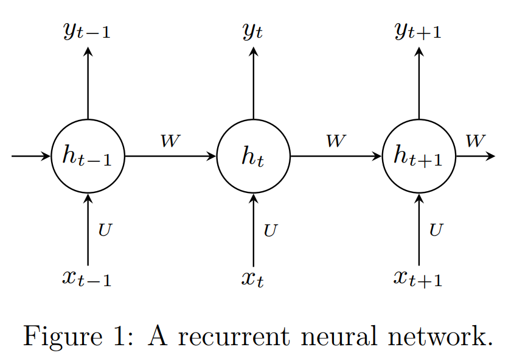
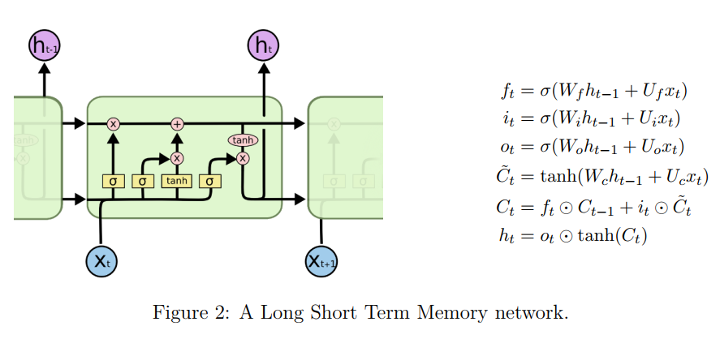

# Homework 5: Recurrent Neural Networks

| Student Name | Student ID |
| :----------: | :--------: |
|    米家龙    |  18342075  |

- [Homework 5: Recurrent Neural Networks](#homework-5-recurrent-neural-networks)
  - [Exercise 1: Backpropagation through Time](#exercise-1-backpropagation-through-time)
    - [ex.1 (a)](#ex1-a)
    - [ex.1 (b)](#ex1-b)
  - [Exercise 2: Vanishing/Exploding Gradients in RNNs](#exercise-2-vanishingexploding-gradients-in-rnns)
    - [ex.2 (a)](#ex2-a)
    - [ex.2 (b)](#ex2-b)
    - [ex.2 (c)](#ex2-c)
  - [Exercise 3: LSTMs](#exercise-3-lstms)
    - [ex.3 (a)](#ex3-a)
    - [ex.3 (b)](#ex3-b)
    - [ex.3 (c)](#ex3-c)

## Exercise 1: Backpropagation through Time

Consider the RNN (Recurrent Neural Network) as:

Each state $h_t$ is given by:

$$
\begin{aligned}
  h_t = \sigma (Wh_{t - 1} + Ux_t), \text{where} \ \sigma (z) = \frac{1}{1 + \exp(-z)}
\end{aligned}
$$

Let $L$ be a loss function defined as the sum over the losses $L_t$ at every time step until time $T$: $L = \sum^T_{t=0} L_t$, where $L_t$ is a scalar loss depending on $h_t$.

In the following, we want to derive the gradient of this loss function with respect to the parameter $W$.

### ex.1 (a)

Suppose we have $y = \sigma(Wx)$ where $y \in \R^n, x \in \R^d$ and $W \in \R^{n \times d}$. Derive the Jacobian $\frac{\partial y}{\partial x} = \rm{diag}(\sigma ') \ W \in \R^{n \times d}$

---

根据已知条件，可以通过链式法则得到：

$$
\begin{aligned}
  \frac{\partial y}{\partial x} & = \frac{\partial \ \sigma(Wx)}{\partial x} \\
                              & = \frac{\partial \ \sigma(Wx)}{\partial Wx} \frac{\partial Wx}{\partial x}
\end{aligned} \tag 1
$$

对于 $Wx$ 有：

$$
\begin{aligned}
  Wx = \begin{bmatrix}
    w_{11} & w_{12} & \cdots & w_{1m} \\
    w_{21} & w_{22} & \cdots & w_{2m} \\
    \vdots & \vdots & \ddots & \vdots \\
    w_{31} & w_{32} & \cdots & w_{3m} \\
    w_{n1} & w_{n2} & \cdots & w_{nm} \\
  \end{bmatrix}
  \begin{bmatrix}
    x_1 \\
    x_2 \\
    \vdots \\
    x_m
  \end{bmatrix} = \begin{bmatrix}
    w_{11} x_1 + w_{12} x_2 + \cdots + w_{1m} x_m \\
    w_{21} x_1 + w_{22} x_2 + \cdots + w_{1m} x_m \\
    \vdots \\
    w_{n1} x_1 + w_{n2} x_2 + \cdots + w_{nm} x_m \\
  \end{bmatrix}
\end{aligned} \tag 2
$$

假设 $p_i = w_{i1} x_1 + w_{i2} x_2 + \cdots + w_{im} x_m$ 因此对于 $\frac{\partial Wx}{\partial x}$：

$$
\begin{aligned}
  \frac{\partial Wx}{\partial x} & = \begin{bmatrix}
    \frac{\partial p_1}{\partial x_1} & \frac{\partial p_1}{\partial x_2} & \cdots & \frac{\partial p_1}{\partial x_m} \\
    \frac{\partial p_2}{\partial x_1} & \frac{\partial p_2}{\partial x_2} & \cdots & \frac{\partial p_2}{\partial x_m} \\
    \vdots & \vdots & \ddots & \vdots \\
    \frac{\partial p_n}{\partial x_1} & \frac{\partial p_n}{\partial x_2} & \cdots & \frac{\partial p_n}{\partial x_m} \\
  \end{bmatrix} \\
  & = \begin{bmatrix}
    w_{11} & w_{12} & \cdots & w_{1m} \\
    w_{21} & w_{22} & \cdots & w_{2m} \\
    \vdots & \vdots & \ddots & \vdots \\
    w_{31} & w_{32} & \cdots & w_{3m} \\
    w_{n1} & w_{n2} & \cdots & w_{nm} \\
  \end{bmatrix} = W
\end{aligned} \tag 3
$$

对于 $\frac{\partial \ \sigma(Wx)}{\partial Wx}$，令 $y_i = \sigma(p_i), \qquad i = 1, 2, \cdots, n$ 则有：

$$
\begin{aligned}
  \frac{\partial \ \sigma(Wx)}{\partial Wx} & = \frac{\partial y}{\partial p} \\
  & = \begin{bmatrix}
    \frac{\partial y_1}{p_1} & \frac{\partial y_2}{p_1} & \cdots & \frac{\partial y_n}{p_1} \\
    \frac{\partial y_2}{p_1} & \frac{\partial y_2}{p_2} & \cdots & \frac{\partial y_2}{p_2} \\
    \vdots & \vdots & \ddots & \vdots \\
    \frac{\partial y_n}{p_1} & \frac{\partial y_n}{p_2} & \cdots & \frac{\partial y_n}{p_n} \\
  \end{bmatrix} \\
  & = \begin{bmatrix}
    \sigma '(p_1) & 0 & \cdots & 0 \\
    0 & \sigma '(p_2) & 0 & \cdots & 0 \\
    \vdots & \vdots & \ddots & \vdots \\
    0 & 0 & 0 & \cdots & \sigma '(p_n) \\
  \end{bmatrix} \\
  & = \rm{diag}(\sigma ')
\end{aligned} \tag 4
$$

根据式$(1), (3), (4)$可得

$$
\begin{aligned}
  \frac{\partial y}{\partial x} = \rm{diag}(\sigma ')W \in \R^{n \times d}
\end{aligned}
$$

### ex.1 (b)

Derive the quantity $\frac{\partial L}{\partial W} = \sum^T_{t = 0} \sum^t_{k = 1} \frac{\partial L_t}{\partial h_t} \frac{\partial h_t}{\partial h_k} \frac{\partial h_k}{\partial W}$.

---

根据 $L = \sum^{T}_{t = 0} L_t$ 的定义，可以得到
$$
\begin{aligned}
 \frac{\partial L}{\partial W} & = \frac{\partial}{\partial W} \sum^{T}_{t = 0} L_t \\
  & = \sum^{T}_{t = 0} \frac{\partial L_t}{\partial W}
\end{aligned} \tag{5}
$$

由于 $L_t$ 是和 $h_t$ 有关的一个标量损失，并且 $h_t$ 有如下表示：

$$
\begin{cases}
  h_t & = \sigma(Wh_{t - 1} + Ux_t) \\
  h_{t - 1} & = \sigma(Wh_{t - 2} + Ux_{t - 1}) \\
  & \vdots \\
  h_1 & = \sigma(Wh_0, + Ux_1) \\
  h_0 & = \sigma(Wh_{f} + Ux_0), \ \text{$h_f$ 和 $W$ 无关}
\end{cases} \tag 6
$$

因此可以得到：

$$
\begin{aligned}
  \frac{\partial L_t}{\partial W} & = (\frac{\partial L_t}{\partial h_t} \frac{\partial h_t}{\partial W}) + (\frac{\partial L_t}{\partial h_t} \frac{\partial h_t}{\partial h_{t - 1}} \frac{\partial h_{t - 1}}{\partial W}) + \cdots + (\frac{\partial L_t}{\partial h_t} \frac{\partial h_t}{\partial h_{t - 1}} \cdots \frac{\partial h_3}{\partial h_2} \frac{\partial h_{2}}{\partial W}) + (\frac{\partial L_t}{\partial h_t} \frac{\partial h_t}{\partial h_{t - 1}} \cdots \frac{\partial h_2}{\partial h_1} \frac{\partial h_{1}}{\partial W}) \\
  & = (\frac{\partial L_t}{\partial h_t} \frac{\partial h_t}{\partial h_t} \frac{\partial h_t}{\partial W}) + (\frac{\partial L_t}{\partial h_t} \frac{\partial h_t}{\partial h_{t - 1}} \frac{\partial h_{t - 1}}{\partial W}) + \cdots + (\frac{\partial L_t}{\partial h_t} \frac{\partial h_t}{\partial h_{1}} \frac{\partial h_{1}}{\partial W}) + (\frac{\partial L_t}{\partial h_t} \frac{\partial h_t}{\partial h_{0}} \frac{\partial h_{0}}{\partial W}) \\
  & = \sum^{t}_{k = 0} \frac{\partial L_t}{\partial h_t} \frac{\partial h_t}{\partial h_k} \frac{\partial h_k}{\partial W}
\end{aligned} \tag 7
$$

根据式 $(5), (7)$ 可以得到：

$$
\frac{\partial L}{\partial W} = \sum^T_{t = 0} \sum^t_{k = 0} \frac{\partial L_t}{\partial h_t} \frac{\partial h_t}{\partial h_k} \frac{\partial h_k}{\partial W} \tag 8
$$

> 发现结果和题目有矛盾，$k$ 应该从0而不是1开始

## Exercise 2: Vanishing/Exploding Gradients in RNNs

In this exercise, we want to understand why RNNs (Recurrent Neural Networks) are specially prone to the Vanishing/Exploding Gradients problem and what role the igenvalues of the weight matrix play. Consider part (b) of exercise 1 again.

### ex.2 (a)

Write down $\frac{\partial L}{\partial W}$ as expanded sum for $T = 3$. You should see that if we want to backpropagate through $n$ timesteps, we have to multiply the matrix $\rm{diag}(σ')W$ $n$ times with itself.

---

由式 $(7)$ 可得，当 $T = 3$时，有：

$$
\begin{aligned}
  \frac{\partial L}{\partial W} & = \sum_{t = 0}^{T = 3} \sum^t_{k = 0} \frac{\partial L_t}{\partial h_t} \frac{\partial h_t}{\partial h_k} \frac{\partial h_k}{\partial W} \\
  & = (\frac{\partial L_0}{\partial h_0} \frac{\partial h_0}{\partial h_0} \frac{\partial h_0}{\partial W}) + (\frac{\partial L_1}{\partial h_1} \frac{\partial h_1}{\partial h_0} \frac{\partial h_0}{\partial W} + \frac{\partial L_1}{\partial h_1} \frac{\partial h_1}{\partial h_1} \frac  {\partial h_1}{\partial W}) \\
    & \qquad + (\frac{\partial L_2}{\partial h_2} \frac{\partial h_2}{\partial h_0} \frac{\partial h_0}{\partial W} + \frac{\partial L_2}{\partial h_2} \frac{\partial h_2}{\partial h_1} \frac{\partial h_1}{\partial W} + \frac{\partial L_2}{\partial h_2} \frac{\partial h_2}{\partial h_2} \frac{\partial h_2}{\partial W}) \\
    & \qquad + (\frac{\partial L_3}{\partial h_3} \frac{\partial h_3}{\partial h_0} \frac{\partial h_0}{\partial W} + \frac{\partial L_3}{\partial h_3} \frac{\partial h_3}{\partial h_1} \frac{\partial h_1}{\partial W} + \frac{\partial L_3}{\partial h_3} \frac{\partial h_3}{\partial h_2} \frac{\partial h_2}{\partial W} + \frac{\partial L_3}{\partial h_3} \frac{\partial h_3}{\partial h_3} \frac{\partial h_3}{\partial W}) \\
  & = (\frac{\partial L_0}{\partial h_0} \frac{\partial h_0}{\partial W}) + (\frac{\partial L_1}{\partial h_1} \frac{\partial h_1}{\partial h_0} \frac{\partial h_0}{\partial W} + \frac{\partial L_1}{\partial h_1} \frac{\partial h_1}{\partial W}) \\
    & \qquad + (\frac{\partial L_2}{\partial h_2} \frac{\partial h_2}{\partial h_0} \frac{\partial h_0}{\partial W} + \frac{\partial L_2}{\partial h_2} \frac{\partial h_2}{\partial h_1} \frac{\partial h_1}{\partial W} + \frac{\partial L_2}{\partial h_2} \frac{\partial h_2}{\partial W}) \\
    & \qquad + (\frac{\partial L_3}{\partial h_3} \frac{\partial h_3}{\partial h_0} \frac{\partial h_0}{\partial W} + \frac{\partial L_3}{\partial h_3} \frac{\partial h_3}{\partial h_1} \frac{\partial h_1}{\partial W} + \frac{\partial L_3}{\partial h_3} \frac{\partial h_3}{\partial h_2} \frac{\partial h_2}{\partial W} + \frac{\partial L_3}{\partial h_3} \frac{\partial h_3}{\partial W})
\end{aligned} \tag 9
$$

根据式 $(6)$ 可以得到：

$$
\frac{\partial h_t}{\partial h_{t - 1}} = \rm{diag}(\sigma ') W \in \R^{n \times d} \tag{10}
$$

将上式合并，可以得到：

$$
\begin{aligned}
  \frac{\partial L}{\partial W} & = (\frac{\partial L_0}{\partial h_0} \frac{\partial h_0}{\partial W}) + [\frac{\partial L_1}{\partial h_1} (\rm{diag}(\sigma ') W) \frac{\partial h_0}{\partial W} + \frac{\partial L_1}{\partial h_1} \frac{\partial h_1}{\partial W}] \\
    & \qquad + [\frac{\partial L_2}{\partial h_2} (\rm{diag}(\sigma ') W)^2 \frac{\partial h_0}{\partial W} + \frac{\partial L_2}{\partial h_2} (\rm{diag}(\sigma ') W) \frac{\partial h_1}{\partial W} + \frac{\partial L_2}{\partial h_2} \frac{\partial h_2}{\partial W}] \\
    & \qquad + [\frac{\partial L_3}{\partial h_3} (\rm{diag}(\sigma ') W)^3 \frac{\partial h_0}{\partial W} + \frac{\partial L_3}{\partial h_3} (\rm{diag}(\sigma ') W)^2 \frac{\partial h_1}{\partial W} + \frac{\partial L_3}{\partial h_3} (\rm{diag}(\sigma ') W) \frac{\partial h_2}{\partial W} + \frac{\partial L_3}{\partial h_3} \frac{\partial h_3}{\partial W}]
\end{aligned} \tag{11}
$$

在式 $(11)$ 看到，当 $T = 3$ 时，需要乘 $(\rm{diag}(\sigma ') W)$ 3次

### ex.2 (b)

Remember that any diagonalizable (square) matrix $M$ can be represented by its eigendecomposition $M = Q \Lambda Q^{−1}$ where $Q$ is a matrix whose $i$-th column corresponds to the $i$-th eigenvector of $M$ and $Λ$ is a diagonal matrix with the corresponding eigenvalues placed on the diagonals. Recall that every eigenvector $v_i$ satisfies this linear equation $Mv_i = \lambda_i v_i$, where $\lambda_i = \Lambda_{ii}$ is an eigenvalue of $M$. Proof by induction that for such a matrix the product $\prod_{i=1}^{n} M$ can be represented as: $M^n = Q\Lambda^nQ^{-1}$.

---

对于 $n = 1$ 时，根据题目可得：

$$
M^1 = Q \Lambda^1 Q^{-1} \tag{12}  
$$

对于 $n = t - 1$ 时，假设：

$$
M^{t - 1} = Q \Lambda^{t - 1} Q^{-1}
\tag{13}
$$

那么在 $n = t$ 时，可以得到：

$$
\begin{aligned}
  M^t & = M^{t - 1} M \\
      & = (Q \Lambda^{t - 1} Q^{-1}) (Q \Lambda Q^{-1}) \\
      & = Q \Lambda^{t - 1} \Lambda Q^{-1} \\
      & = Q \Lambda^{t} Q^{-1}
\end{aligned} \tag{14}
$$

因此可以得到 $\prod_{i = 1}^{n} M = Q \Lambda^t Q^{-1}$

### ex.2 (c)

Consider the weight matrix $\begin{bmatrix} 0.58 & 0.24 \\ 0.24 & 0.72 \end{bmatrix}$. Its eigendecomposition is:

$$
\begin{aligned}
  W = Q \Lambda Q^{-1} = \begin{bmatrix}
    -0.6 & -0.8 \\
    -0.8 & 0.5
  \end{bmatrix} \begin{bmatrix}
    0.9 & 0 \\
    0 & 0.4
  \end{bmatrix} \begin{bmatrix}
    -0.6 & -0.8 \\
    -0.8 & 0.6
  \end{bmatrix}
\end{aligned}
$$

Calculate $W^{30}$. What do you observe? What happens in general if the absolute value of all eigenvalues of W is smaller than 1? What happens if the absolute value of any eigenvalue of W is larger than 1? What if all eigenvalues are 1?

---

根据式 $(14)$ 可以得到：

$$
\begin{aligned}
  W^{30} & = Q \Lambda^{30} Q^{-1} \\
         & = \begin{bmatrix}
           -0.6 & -0.8 \\
           -0.8 & 0.6
         \end{bmatrix} \begin{bmatrix}
           0.9^{30} & 0 \\
           0 & 0.4^{30}
         \end{bmatrix} \begin{bmatrix}
           -0.6 & -0.8 \\
           -0.8 & 0.6
         \end{bmatrix} \\
         & = \begin{bmatrix}
           0.015260 & 0.020348 \\
           0.020348 & 0.027130
         \end{bmatrix}
\end{aligned} \tag{15}
$$

1. 从式 $(15)$ 可以看出，$\Lambda$ 得30次方会导致结果相对变小很多
2. 当 $W$ 的所有特征值的绝对值都小于1时，$\Lambda$ 对角线上的元素的绝对值也都会小于1，此时对于 $n$ 来说，其递增会导致 $\Lambda$ 指数递减，最终导致 $W^n$ 的值变得很小
3. 当 $W$ 的所有特征值的绝对值都打于1时，$\Lambda$ 对角线上的元素的绝对值也都会大于1，此时对于 $n$ 来说，其递增会导致 $\Lambda$ 指数递增，最终导致 $W^n$ 的值变得很大
4. 当 $W$ 的所有特征值的绝对值都等于1时，$\Lambda$ 对角线上的元素的绝对值也都会等于1，此时对于 $n$ 来说，其无论怎么变化， $\Lambda$ 不变，最终 $W^n$ 的值不变

## Exercise 3: LSTMs

Recall the elements of a module in an LSTM and the corresponding computations, where $\bigodot$ stands for pointwise multiplication. For a good explanation on LSTMs you can refer to [http://colah.github.io/posts/2015-08-Understanding-LSTMs/](http://colah.github.io/posts/2015-08-Understanding-LSTMs/). Consider the LSTM in Figure 2.

### ex.3 (a)

What do the gates $f_t$, $i_t$ and $o_t$ do?

---

- 遗忘门 $f_t$：选择上一时刻状态 $C_{t - 1}$ 的部分信息融入当前状态 $C_t$，选择性的将 $C_{t - 1}$ 中与当前词 $x_t$ 无关的内容遗忘并保留有用的信息
- 输入门 $i_t$：判断当前词 $x_t$ 的信息，选择性的进行保留进细胞当前状态 $C_t$ 或者丢弃
- 输出门 $o_t$：判断当前细胞状态 $C_t$ 的有用信息，并选择性的输出到隐层 $h_t$ 中

### ex.3 (b)

Which of the quantities next to the figure are always positive?

Let’s now try to understand how this architecture approaches the vanishing gradients problem. To calculate the gradient $\frac{\partial L}{\partial \theta}$ , where $\theta$ stands for the parameters $(W_f, W_o, W_i, W_c)$, we now have to consider the cell state $C_t$ instead of $h_t$. Like $h_t$ in normal RNNs, $C_t$ will also depend on the previous cell states $C_{t−1}, \cdots , C_0$, so we get a formula of the form:

$$
\begin{aligned}
  \frac{\partial L}{\partial W} = \sum^T_{t = 0} \sum^t_{k = 1} \frac{\partial L_t}{\partial C_t} \frac{\partial C_t}{\partial C_k} \frac{\partial C_k}{\partial W}
\end{aligned}
$$

where note that the real formula is a bit more complicated since $C_t$ also depends on $f_t$, $i_t$ and $\tilde{C}_t$, which in turn all depend on $W$, but this can be neglected.

---

对于 $f_t$, $i_t$ 和 $o_t$ 来说，采用了 Sigmoid 函数，而该函数值域为 $(0, 1)$，因此符号总是为正的

对于 $\tilde{C_t}$ 由于 Tanh 函数的值域为 $(-1, 1)$，因此 $\tilde{C_t}$，$h_t$ 和 $C_t$ 都可能符号为负

### ex.3 (c)

We know that $\frac{\partial C_t}{\partial C_k} = \prod_{i = k + 1}^t \frac{\partial C_t}{\partial C_{t - 1}}$. Let $f_t = 1$ and $i_t = 0$ such that $C_t = C_{t−1}$ for all $t$. What is the gradient $\frac{\partial C_t}{\partial C_k}$ in this case?

---

$$
\begin{aligned}
  \frac{\partial C_t}{\partial C_k} = \prod_{i = k + 1}^{t} \frac{\partial C_t}{\partial C_{t - 1}} = \prod_{i = k + 1}^{t} 1 = 1
\end{aligned} \tag{16}
$$

显然，梯度为1